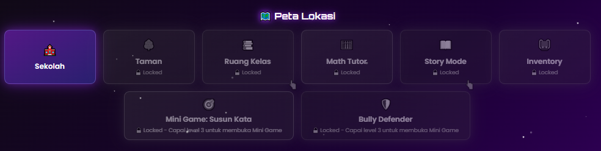
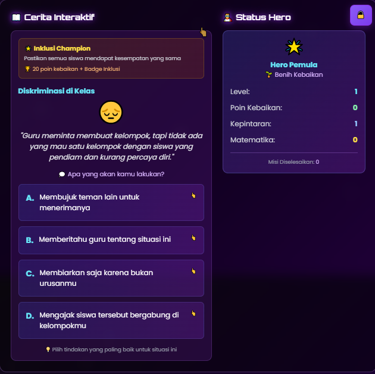
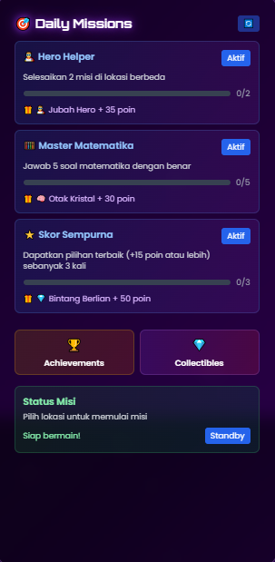

<!-- Banner / Logo -->

  

<h1 align="center">🚀 Hero Kebaikan: Misi Anti-Bullying 💥💬</h1>

<b>Game interaktif penuh aksi dan empati! Lawan bullying, bantu teman, jadilah pahlawan di sekolahmu!</b>

---

## 📊 Status & Badge

---

## 🔥 Tentang Game Ini
**Pahlawan Sekolah** adalah game edukasi bertema **anti-bullying** dengan visual bergaya kartun, warna cerah, dan gameplay seru berbasis **pilihan aksi**.  
Cocok dimainkan oleh **anak-anak, remaja, guru**, bahkan **developer** yang ingin ikut dalam gerakan **Stop Bullying!** 🚫👊

🎯 Kamu berperan sebagai **siswa** dengan misi penting:  
> Membantu teman, melawan bullying, dan menyebarkan kebaikan di sekolah.

---

## 🎮 Fitur-Fitur Seru
| Fitur | Deskripsi |
|-------|-----------|
| 🏫 Eksplorasi Sekolah | Jelajahi kelas, kantin, taman, dan lorong sekolah |
| 💬 Pilihan Aksi Nyata | Laporkan pelaku, temani korban, atau beri semangat |
| ⭐ Level Up Empati | Kumpulkan poin *Kebaikan* dan naikkan reputasi |
| 🧠 Mini Game Edukatif | Tebak emosi, pecahkan teka-teki, bantu karakter |
| 🎨 Visual Kartun Full Color | Gaya fun, ekspresif, ramah anak |

---

## 🧩 Genre & Teknologi
- **Genre**: Edukasi Interaktif + RPG Ringan  
- **Engine**: Godot / Unity / HTML5 / Scratch *(sesuaikan)*  
- **Visual**: Kartun lucu, penuh ekspresi, warna cerah  

---

## 📸 Cuplikan Gameplay

  
  
  

---

## 💡 Kenapa Game Ini Dibuat?
Bullying itu nyata, dan banyak anak tidak tahu bagaimana harus bereaksi.  
Lewat game ini, pemain diajak untuk:
- 🤝 **Belajar empati**
- 💪 **Melatih keberanian sosial**
- ✅ **Mengambil sikap yang benar**

---

## 👨‍💻 Kontribusi Terbuka!
Kami membuka kontribusi dari siapa saja:
- 🔧 Tambah **level** / **misi baru**
- 🎨 Desain **karakter** atau **item**
- 🌍 Terjemahan ke **bahasa lain**
- 📢 Sebarkan pesan **anti-bullying**

📬 **Hubungi kami** untuk bergabung sebagai kontributor.

---

## 📜 Lisensi
Proyek ini dirilis di bawah lisensi **MIT**.  
Bebas digunakan, dimodifikasi, dan dikembangkan untuk tujuan positif.

---
